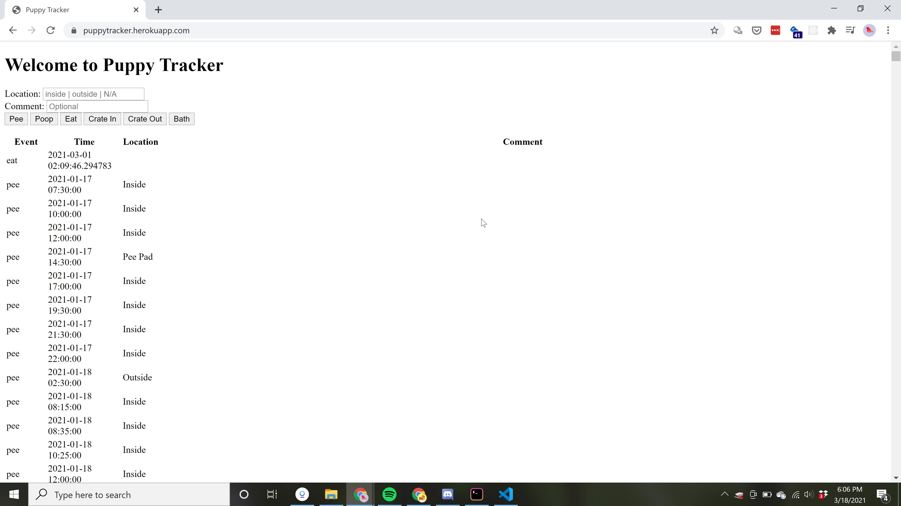

Puppy Tracker is a simple way to keep track of all your puppy's daily activities! This is a helpful way to see potty training trends and decide how often you should take the pup outside!

## About Me

Amanda has always been fascinated with understanding how things work
and how our mind processes what goes on around us. Before starting her
Hackbright journey, Amanda taught private, corporate, and public yoga classes
throughout the Bay Area. She studied Biology and Chemistry and worked at a
biotech startup, prior to moving to San Francisco. Enjoying the creativity that
teaching allows but craving challenge and constant opportunity to learn and
expand, Amanda found her way to coding. Drawing from her training in mindfulness
and meditation, she is excited to be a part of building the future using
technology to better understand the world around us, connect with each other,
and connect more deeply with ourselves.

## Contents

- [Tech Stack](#tech-stack)
- [Features](#features)
- [Future State](#future)
- [Installation](#installation)
- [License](#license)

## Technologies

- Python
- Flask
- PostgresQL
- SQLAlchemy
- HTML
- jQuery
